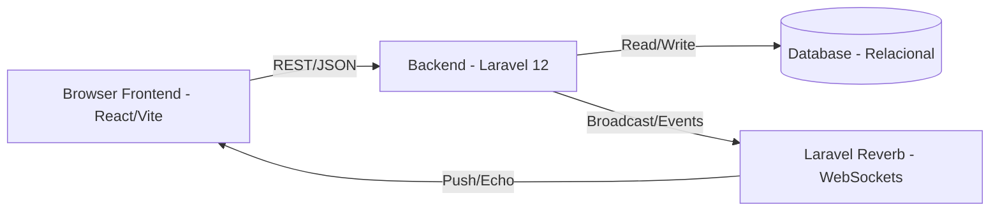

# Arquitetura do Sistema

A aplicação foi desenhada visando separação de responsabilidades (Decoupled/API-First Architecture), dividida majoritariamente em Backend (API REST) e Frontend (SPA/PWA).

## Visão Geral da Comunicação

## 1. Backend: API RESTful com Laravel
A pasta `backend/` abriga o servidor em Laravel focado na entrega de rotas de API. Ele se coordena na arquitetura MVC padrão (com foco especial em Models, Controllers e API Resources).
- **Segurança:** Utiliza o Laravel Sanctum para emissão e validação de tokens `Bearer` ao longo da API, permitindo comunicação Stateless segura com a SPA web.
- **Autorização:** Validada a nível de Middleware utilizando o pacote Spatie Permissions (Ex.: apenas usuários da role X podem acessar as rotas financeiras).
- **Filas & Performance:** O projeto declara scripts de inicialização rodando o *Queue Worker* (`php artisan queue:listen`), e a base prevê Octane para ganho de TPS.

## 2. Frontend: SPA baseada em React
A aplicação consumidora (em `frontend/`) utiliza React compilado por Vite. Ela gerencia o estado usando o React Query.
- **Sincronização de Estado:** Ao invés de usar Redux (globais síncronos), usa-se intensamente o `useQuery` e `useMutation` do `@tanstack/react-query`, o que facilita "cachear" as chamadas RESTful do backend.
- **Roteamento Dinâmico:** As páginas (provavelmente componentes encapsulados pela `react-router-dom`) representam módulos específicos (ex. Módulo Kanban, Vendas, Cadastros).

## 3. Mensageria e WebSockets (Real-time)
Ao observar as dependências e o contexto (Laravel Reverb + Laravel Echo/Pusher no JS + tabelas de ticket / notifications), o sistema trabalha com reatividade.
Quando uma ação ocorre na API (ex. `TicketAssignedNotification` é instanciado em um controller de Ticket) o backend despacha (Dispatch/Broadcast) um evento. O servidor Reverb propaga este payload via WSS para o front, que o captura usando o Laravel Echo e atua gerando avisos no UI (ex: via `sonner` ou `react-hot-toast`).
